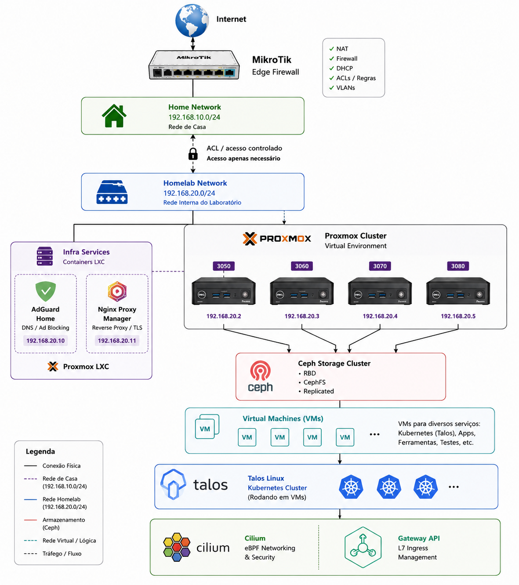

# 🏠 Fábio's Homelab

> Infraestrutura pessoal utilizada para aprimorar conhecimentos em DevOps, SRE e Platform Engineering através de automação, infraestrutura como código e tecnologias cloud native.

## 👋 Sobre

Este repositório centraliza a configuração da minha infraestrutura pessoal, automações e experimentos relacionados a:

- DevOps
- Site Reliability Engineering (SRE)
- Platform Engineering
- Infrastructure as Code (IaC)
- GitOps
- Observabilidade

Além de servir como laboratório para novas tecnologias, também é utilizado para validar arquiteturas, automações e boas práticas aplicadas no dia a dia profissional.

<details>
  <summary>🏗️ Arquitetura do Homelab</summary>

<br>

<p align="center">
  <a href="./docs/images/topologia.png" target="_blank" rel="noopener noreferrer">
    
  </a>
</p>

<p align="center"><small>Clique na imagem para abrir em tamanho original.</small></p>

</details>

## 🖥️ Hardware

| Host | Modelo | CPU | RAM |
|--------|--------|------|------|
| pve01 | Dell 3080 | Intel i5 | 16 GB |
| pve02 | Dell 3070 | Intel i5 | 16 GB |
| pve03 | Dell 3060 | Intel i5 | 16 GB |
| pve04 | Dell 3050 | Intel i5 | 16 GB |

**Armazenamento distribuído:** 2,5 TB utilizando Ceph.

## 🚀 Stack

### Infraestrutura
- Proxmox VE
- Ceph
- Terraform
- Terragrunt
- Ansible

### Cloud Native
- Talos Linux
- Kubernetes
- ArgoCD
- Cilium
- Gateway API

### Observabilidade
- Prometheus
- Grafana
- Loki
- Tempo
- OpenTelemetry

### Automação

- Taskfile
- Shell Script
- GitHub Actions

## 📂 Estrutura

```text
.
├── ansible/
├── kubernetes/
├── talos/
├── terraform-modules/
├── terragrunt/
├── scripts/
└── .taskfiles/
```
