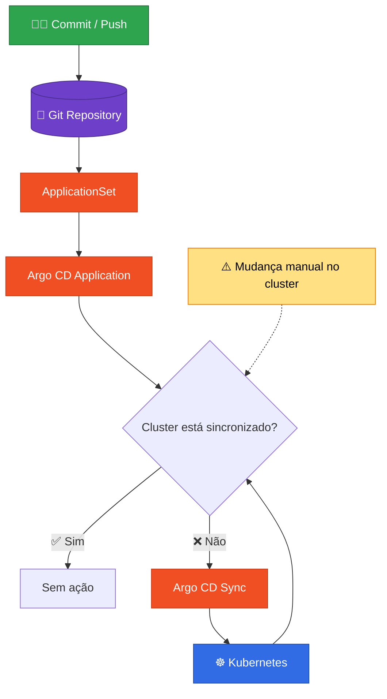
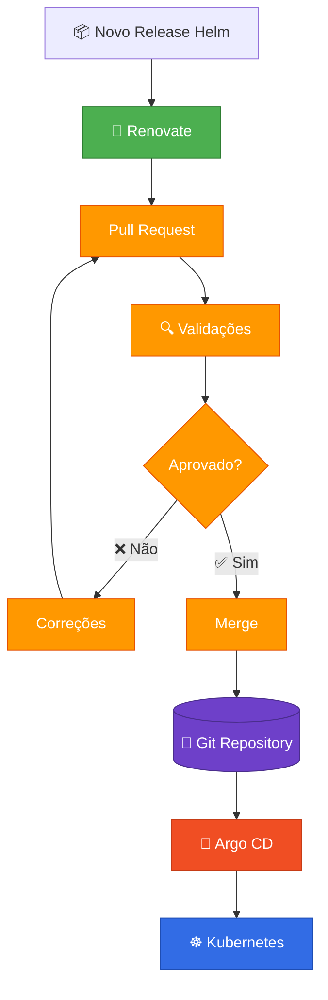

# Kubernetes Addons GitOps

## Objetivo

Este documento descreve como os addons do Kubernetes são gerenciados através de GitOps utilizando ArgoCD, ApplicationSet e Renovate.

## Visão Geral

O repositório é a única fonte de verdade (Source of Truth) para toda a configuração do cluster. Nenhuma alteração deve ser aplicada manualmente diretamente no Kubernetes. Todo o ciclo de vida dos addons ocorre através de Pull Requests e sincronização automática realizada pelo ArgoCD.

### Estrutura dos Addons

```text
kubernetes/
└── addons/
    ├── cert-manager/
    │   ├── Chart.yaml
    │   ├── values/
    │   │   ├── common.yaml
    │   │   ├── stg.yaml
    │   │   ├── sdx.yaml
    │   │   └── prod.yaml
    │   └── config.yaml
    │
    ├── external-secrets/
    │   ├── Chart.yaml
    │   ├── values/
    │   └── config.yaml
    │
    └── ...
```

Cada addon possui:

* Chart Helm (`Chart.yaml`)
* Configuração própria (`config.yaml`)
* Valores compartilhados (`common.yaml`)
* Valores específicos por cluster (`<cluster>.yaml`)

### ApplicationSet

O ArgoCD utiliza um único ApplicationSet para descobrir automaticamente os addons existentes. O generator lê todos os arquivos:

```text
kubernetes/addons/*/config.yaml
```

Para cada addon encontrado é criado automaticamente um Application correspondente.

Benefícios:

* Evita duplicação de manifests.
* Escala facilmente para novos clusters.
* Mantém padronização entre addons.
* Reduz manutenção operacional.

### Fluxo

<details>
  <summary>Fluxo de sincronização</summary>


</details>

### Atualização de Versões

As versões dos charts Helm são monitoradas automaticamente pelo Renovate, quando uma nova versão é disponibilizada:

1. Renovate identifica a atualização.
2. Renovate cria um Pull Request.
3. Os manifests são validados.
4. O Pull Request é revisado.
5. O merge é realizado.
6. Argo CD sincroniza automaticamente.

### Fluxo de Atualização com Renovate

<details>
  <summary>Fluxo Renovate → Argo CD</summary>


</details>

### Validações

Antes de qualquer alteração ser aplicada ao cluster, os manifests passam por validações automáticas.

Validações:

* Helm template
* Kubeconform (schema validation)
* Kubepug (API deprecation checks)
* ArgoCD Diff Preview

Objetivos:

* Validar manifests Kubernetes
* Detectar APIs depreciadas
* Detectar APIs removidas na versão alvo do cluster
* Visualizar mudanças antes do merge

### Benefícios da Arquitetura

* Git como fonte única de verdade.
* Deploys reproduzíveis.
* Recuperação automática de drift.
* Atualizações controladas via Pull Request.
* Padronização entre clusters.
* Menor esforço operacional.
* Facilidade para auditoria e troubleshooting.

